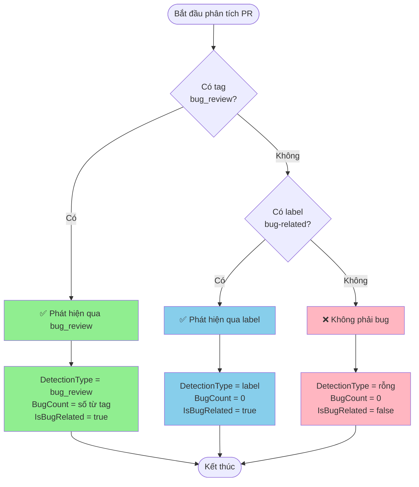

# Hướng Dẫn Phát Hiện Bug

## Giới Thiệu

Hệ thống **Bug Crawler** tự động phân tích các Pull Request (PR) trên GitHub để phát hiện những thay đổi liên quan đến việc sửa lỗi (bug). Tài liệu này giải thích cách hệ thống hoạt động một cách dễ hiểu, giúp bạn biết cách đánh dấu PR để hệ thống nhận diện chính xác.

## Hệ Thống Phát Hiện Bug Hoạt Động Như Thế Nào?

Khi một PR được tạo ra, hệ thống sẽ tự động kiểm tra theo **thứ tự ưu tiên** để xác định xem PR đó có liên quan đến việc sửa bug hay không.

### 🎯 Thứ Tự Ưu Tiên Phát Hiện

Hệ thống kiểm tra theo 2 mức độ ưu tiên, từ cao xuống thấp:

#### **Mức 1: Phát Hiện Qua Tag `bug_review`** (Ưu tiên cao nhất)

Đây là cách **chính xác nhất** để đánh dấu một PR là bug fix. Nếu phát hiện được tag này, hệ thống sẽ ngay lập tức xác định PR là bug-related và **không kiểm tra thêm** các tiêu chí khác.

**Cách sử dụng:**

Trong phần mô tả (description) của PR, thêm dòng:

```
bug_review: <số_lượng_bug>
```

**Ví dụ:**

```markdown
## Mô tả
PR này sửa lỗi hiển thị sai định dạng ngày tháng trong báo cáo.

bug_review: 3

## Chi tiết
- Sửa lỗi format ngày tháng
- Sửa lỗi timezone
- Sửa lỗi hiển thị giờ
```

> [!IMPORTANT]
> - Tag `bug_review` **không phân biệt chữ hoa/thường** (có thể viết `BUG_REVIEW`, `Bug_Review`, v.v.)
> - Số lượng bug phải là **số nguyên dương** (1, 2, 3,...)
> - Hệ thống sẽ ghi nhận **số lượng bug** được sửa trong PR này

**Kết quả khi phát hiện:**
- ✅ `IsBugRelated`: `true`
- 📊 `DetectionType`: `"bug_review"`
- 🔢 `BugCount`: Số lượng bug bạn đã ghi
- 🏷️ `MatchedKeyword`: `"bug_review"`

---

#### **Mức 2: Phát Hiện Qua Label** (Ưu tiên thứ hai)

Nếu không tìm thấy tag `bug_review`, hệ thống sẽ kiểm tra các **label** được gắn vào PR.

**Label nào được nhận diện?**

Hệ thống sẽ tìm các label có chứa các từ khóa sau (không phân biệt chữ hoa/thường):

- `bug` - Lỗi chung
- `fix` - Sửa lỗi
- `hotfix` - Sửa lỗi khẩn cấp
- `critical` - Lỗi nghiêm trọng
- `error` - Lỗi hệ thống
- `issue` - Vấn đề cần sửa

**Ví dụ các label hợp lệ:**
- ✅ `bug`
- ✅ `Bug Fix`
- ✅ `hotfix-payment`
- ✅ `critical-error`
- ✅ `issue/login`
- ✅ `BUGFIX`

**Ví dụ các label KHÔNG được nhận diện:**
- ❌ `feature`
- ❌ `enhancement`
- ❌ `documentation`
- ❌ `refactor`

**Kết quả khi phát hiện:**
- ✅ `IsBugRelated`: `true`
- 📊 `DetectionType`: `"label"`
- 🔢 `BugCount`: `0` (vì không có thông tin cụ thể)
- 🏷️ `MatchedKeyword`: Tên label được tìm thấy (ví dụ: `"bug"`, `"hotfix"`)

---

### ❌ Khi Nào PR Không Được Xác Định Là Bug?

Nếu PR **không có** cả hai điều kiện trên:
- Không có tag `bug_review` trong mô tả
- Không có label liên quan đến bug

Thì hệ thống sẽ **không** xác định PR này là bug-related.

**Kết quả:**
- ❌ `IsBugRelated`: `false`
- 📊 `DetectionType`: `""` (rỗng)
- 🔢 `BugCount`: `0`
- 🏷️ `MatchedKeyword`: `""` (rỗng)

---

## 📋 Hướng Dẫn Sử Dụng Cho Các Trường Hợp Thực Tế

### Trường Hợp 1: Sửa Nhiều Bug Trong Một PR

**Tình huống:** Bạn vừa sửa 5 bug khác nhau trong cùng một PR.

**Khuyến nghị:** Sử dụng tag `bug_review` với số lượng chính xác

```markdown
## Mô tả
PR này sửa các lỗi trong module thanh toán

bug_review: 5

## Danh sách bug đã sửa
1. Lỗi tính toán VAT
2. Lỗi làm tròn số tiền
3. Lỗi hiển thị mã giảm giá
4. Lỗi xử lý thanh toán quốc tế
5. Lỗi timeout khi thanh toán
```

### Trường Hợp 2: Hotfix Khẩn Cấp

**Tình huống:** Có lỗi nghiêm trọng trên production cần sửa ngay.

**Khuyến nghị:** Kết hợp cả tag `bug_review` và label `hotfix`

- **Mô tả PR:** Thêm `bug_review: 1`
- **Label:** Gắn label `hotfix` hoặc `critical`

> [!TIP]
> Mặc dù hệ thống chỉ cần một trong hai, việc sử dụng cả hai giúp PR dễ theo dõi hơn cho team.

### Trường Hợp 3: PR Vừa Sửa Bug Vừa Thêm Feature

**Tình huống:** PR của bạn vừa sửa 2 bug, vừa thêm 1 tính năng mới.

**Khuyến nghị:** Vẫn đánh dấu là bug-related với số lượng bug chính xác

```markdown
## Mô tả
PR này thêm tính năng xuất báo cáo PDF và sửa một số lỗi liên quan

bug_review: 2

## Nội dung
**Features:**
- Thêm chức năng xuất PDF

**Bug Fixes:**
- Sửa lỗi encoding tiếng Việt
- Sửa lỗi format số tiền
```

### Trường Hợp 4: Refactor Code (Không Phải Bug)

**Tình huống:** Bạn đang tái cấu trúc code để dễ đọc hơn, không sửa bug.

**Khuyến nghị:** KHÔNG sử dụng tag `bug_review` và label bug

- **Mô tả PR:** Mô tả bình thường về việc refactor
- **Label:** Sử dụng `refactor`, `cleanup`, `enhancement`

---

## 🔍 Hiểu Kết Quả Phân Tích

Sau khi hệ thống phân tích, mỗi PR sẽ có các thông tin sau:

| Trường | Ý Nghĩa | Giá Trị Có Thể |
|--------|---------|----------------|
| **IsBugRelated** | PR có liên quan đến bug không? | `true` hoặc `false` |
| **DetectionType** | Phát hiện bằng cách nào? | `"bug_review"`, `"label"`, hoặc `""` (rỗng) |
| **BugCount** | Số lượng bug được sửa | Số nguyên ≥ 0 |
| **MatchedKeyword** | Từ khóa/label nào được tìm thấy? | Tên tag hoặc label |

### Ví Dụ Kết Quả

**Ví dụ 1:** PR có tag `bug_review: 3`
```json
{
  "IsBugRelated": true,
  "DetectionType": "bug_review",
  "BugCount": 3,
  "MatchedKeyword": "bug_review"
}
```

**Ví dụ 2:** PR có label `hotfix`
```json
{
  "IsBugRelated": true,
  "DetectionType": "label",
  "BugCount": 0,
  "MatchedKeyword": "hotfix"
}
```

**Ví dụ 3:** PR không liên quan bug
```json
{
  "IsBugRelated": false,
  "DetectionType": "",
  "BugCount": 0,
  "MatchedKeyword": ""
}
```

---

## ✅ Best Practices (Thực Hành Tốt Nhất)

### 1. **Luôn Sử Dụng Tag `bug_review` Khi Sửa Bug**

Đây là cách chính xác nhất để hệ thống nhận diện và đếm số lượng bug.

### 2. **Ghi Số Lượng Bug Chính Xác**

Nếu sửa 3 bug thì ghi `bug_review: 3`, không làm tròn hoặc ước lượng.

### 3. **Sử Dụng Label Phù Hợp**

- Bug thông thường: `bug`
- Bug khẩn cấp: `hotfix` hoặc `critical`
- Bug nhỏ: `fix`

### 4. **Mô Tả Rõ Ràng Trong PR**

Dù hệ thống tự động phát hiện, việc mô tả chi tiết giúp team hiểu rõ hơn về các bug đã sửa.

### 5. **Không Lạm Dụng Tag Bug**

Chỉ đánh dấu bug khi thực sự sửa lỗi, không dùng cho refactor hoặc improvement.

---

## ❓ Câu Hỏi Thường Gặp (FAQ)

### Q1: Tôi có thể viết `BUG_REVIEW` thay vì `bug_review` không?

**A:** Có, hệ thống không phân biệt chữ hoa/thường. Các cách viết sau đều hợp lệ:
- `bug_review: 2`
- `BUG_REVIEW: 2`
- `Bug_Review: 2`

### Q2: Nếu tôi thêm cả tag `bug_review` và label `bug` thì sao?

**A:** Hệ thống sẽ ưu tiên `bug_review` (mức 1) và bỏ qua label. Kết quả sẽ có `DetectionType: "bug_review"`.

### Q3: Tôi có thể ghi `bug_review: 0` không?

**A:** Không nên. Số lượng bug phải lớn hơn 0. Nếu ghi 0, hệ thống sẽ không nhận diện PR là bug-related.

### Q4: Label `bugfix` (viết liền) có được nhận diện không?

**A:** Có, vì hệ thống tìm kiếm từ khóa `bug` trong label, nên `bugfix` sẽ match.

### Q5: Tôi sửa bug nhưng quên đánh dấu, có sao không?

**A:** PR sẽ không được tính vào thống kê bug. Bạn có thể edit mô tả PR hoặc thêm label sau để hệ thống nhận diện lại.

### Q6: Hệ thống có kiểm tra nội dung code không?

**A:** Không, hệ thống chỉ phân tích **mô tả PR** và **label**, không đọc code thực tế.

---

## 📊 Tóm Tắt Quy Trình



---

## 📞 Hỗ Trợ

Nếu bạn có thắc mắc hoặc gặp vấn đề với hệ thống phát hiện bug, vui lòng:

1. Kiểm tra lại format của tag `bug_review` và label
2. Xem lại các ví dụ trong tài liệu này
3. Liên hệ team để được hỗ trợ

---

**Phiên bản:** 1.0  
**Cập nhật lần cuối:** 2025-11-25
