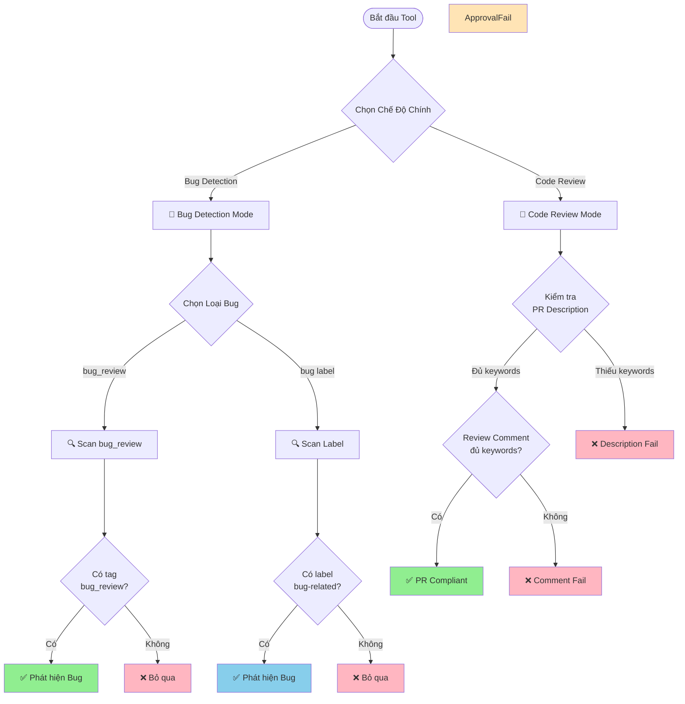

# Hướng Dẫn Phát Hiện Bug

## Giới Thiệu

Hệ thống **Bug Crawler** tự động phân tích các Pull Request (PR) trên GitHub với **hai chức năng chính**:

1. **Bug Detection**: Phát hiện những thay đổi liên quan đến việc sửa lỗi (bug)
2. **Code Review Compliance**: Kiểm tra mức độ tuân thủ quy trình Code Review

Khi chạy tool, bạn sẽ được yêu cầu chọn một trong hai chế độ scan này.

---

## 🔍 Chọn Chế Độ Scan

Khi khởi động tool, bạn sẽ thấy menu chọn chế độ:

```
Step 3: Chọn Chế Độ Scan
------------------------------------------
Chọn chế độ scan:
  1. Bug Detection (Scan bugs)
  2. Code Review Compliance (Scan PR rules)
```

### Chế Độ 1: Bug Detection

Chế độ này tập trung vào việc **phát hiện và đếm số lượng bug** đã được sửa trong các PR. Phù hợp khi bạn muốn:
- 📊 Thống kê số lượng bug đã sửa trong một khoảng thời gian
- 📈 Theo dõi xu hướng bug theo thời gian
- 🔍 Tìm các PR liên quan đến bug fix

**Kết quả:** File CSV với thông tin về bug (`bug_report.csv`)

### Chế Độ 2: Code Review Compliance

Chế độ này kiểm tra **chất lượng quy trình Code Review** của team. Phù hợp khi bạn muốn:
- ✅ Đánh giá mức độ tuân thủ quy trình review
- 📋 Kiểm tra PR description có đầy đủ thông tin không
- 👥 Đảm bảo review comments có chất lượng
- 📊 Theo dõi compliance rate của team

**Kết quả:** File CSV với thông tin về compliance (`pr_rules_report.csv`)

> [!TIP]
> Bạn có thể chạy tool nhiều lần với các chế độ khác nhau để có cái nhìn toàn diện về cả bug fixes và code review quality.

---

## 📋 Chế Độ Bug Detection - Các Loại Scan

Khi chọn chế độ **Bug Detection**, hệ thống sẽ yêu cầu bạn chọn loại scan cụ thể:

Khi chạy tool, bạn sẽ được yêu cầu chọn một trong hai chế độ scan sau:

### 1. Chế Độ Scan theo `bug_review` Tag

Chế độ này tìm kiếm các PR có chứa tag `bug_review` trong phần mô tả. Đây là cách **chính xác nhất** để đếm số lượng bug cụ thể.

**Cách sử dụng:**

Trong phần mô tả (description) của PR, thêm dòng:

```
bug_review: <số_lượng_bug>
```

**Ví dụ:**

```markdown
## Mô tả
PR này sửa lỗi hiển thị sai định dạng ngày tháng trong báo cáo.

bug_review: 3

## Chi tiết
- Sửa lỗi format ngày tháng
- Sửa lỗi timezone
- Sửa lỗi hiển thị giờ
```

> [!IMPORTANT]
> - Tag `bug_review` **không phân biệt chữ hoa/thường** (có thể viết `BUG_REVIEW`, `Bug_Review`, v.v.)
> - Số lượng bug phải là **số nguyên dương** (1, 2, 3,...)
> - Hệ thống sẽ ghi nhận **số lượng bug** được sửa trong PR này

**Kết quả khi phát hiện:**
- ✅ `IsBugRelated`: `true`
- 📊 `DetectionType`: `"bug_review"`
- 🔢 `BugCount`: Số lượng bug bạn đã ghi
- 🏷️ `MatchedKeyword`: `"bug_review"`

---

### 2. Chế Độ Scan theo Label

Chế độ này tìm kiếm các PR được gắn các **label** liên quan đến bug. Chế độ này phù hợp để tìm kiếm nhanh các PR sửa lỗi mà không cần đếm số lượng bug cụ thể.

**Label nào được nhận diện?**

Hệ thống sẽ tìm các label có chứa các từ khóa sau (không phân biệt chữ hoa/thường):

- `bug` - Lỗi chung
- `fix` - Sửa lỗi
- `hotfix` - Sửa lỗi khẩn cấp
- `critical` - Lỗi nghiêm trọng
- `error` - Lỗi hệ thống
- `issue` - Vấn đề cần sửa

**Ví dụ các label hợp lệ:**
- ✅ `bug`
- ✅ `Bug Fix`
- ✅ `hotfix-payment`
- ✅ `critical-error`
- ✅ `issue/login`
- ✅ `BUGFIX`

**Ví dụ các label KHÔNG được nhận diện:**
- ❌ `feature`
- ❌ `enhancement`
- ❌ `documentation`
- ❌ `refactor`

**Kết quả khi phát hiện:**
- ✅ `IsBugRelated`: `true`
- 📊 `DetectionType`: `"label"`
- 🔢 `BugCount`: `0` (vì không có thông tin cụ thể)
- 🏷️ `MatchedKeyword`: Tên label được tìm thấy (ví dụ: `"bug"`, `"hotfix"`)

### 3. Chế Độ Scan cho Bitbucket và Backlog

Đối với **Bitbucket** và **Backlog**, ngoài việc scan theo label (nếu platform hỗ trợ), tool còn hỗ trợ tìm kiếm từ khóa trong **PR Description**.

**Cú pháp:**
```
type: bug
```
(Không phân biệt chữ hoa/thường, có thể có khoảng trắng sau dấu hai chấm)

Nếu tìm thấy cụm từ này trong mô tả PR, tool sẽ ghi nhận:
- ✅ `IsBugRelated`: `true`
- 📊 `DetectionType`: `"description_regex"`
- 🏷️ `MatchedKeyword`: `"type: bug"`

---

## 📝 Chế Độ Code Review Compliance - Kiểm Tra Quy Trình Review

Khi chọn chế độ **Code Review Compliance**, tool sẽ kiểm tra mức độ tuân thủ quy trình Code Review của team thông qua 3 tiêu chí chính:

### 1. Kiểm Tra PR Description (Mô Tả PR)

Tool sẽ quét phần mô tả của PR và kiểm tra xem có chứa **ít nhất 3** trong các keyword sau không:

| Keyword | Ý Nghĩa |
|---------|---------|
| **Description** | Mô tả tổng quan về PR |
| **Changes Made** | Danh sách các thay đổi đã thực hiện |
| **Self-Review** | Checklist tự kiểm tra của người tạo PR |
| **Functionality** | Mô tả về chức năng được thêm/sửa |
| **Security** | Đánh giá về bảo mật |
| **Error Handling** | Cách xử lý lỗi |
| **Code Style** | Tuân thủ coding convention |

**Ví dụ PR Description đạt chuẩn:**

```markdown
## Description
Thêm tính năng xác thực hai yếu tố (2FA) cho module đăng nhập

## Changes Made
- Thêm middleware xác thực 2FA
- Tạo API endpoint `/auth/verify-2fa`
- Cập nhật UI trang đăng nhập

## Self-Review
- [x] Code đã được test với nhiều test cases
- [x] Performance không bị ảnh hưởng

## Functionality
Người dùng có thể bật/tắt 2FA trong settings.

## Security
- Sử dụng TOTP theo RFC 6238
- Secret key được mã hóa trong database

## Error Handling
- Invalid OTP: Trả về lỗi 401 với message rõ ràng
- Tất cả errors đều được log

## Code Style
- Đã chạy `golangci-lint` - no issues
- Code formatted với `gofmt`
```

### 2. Kiểm Tra Review Comment

Tool sẽ quét comment của reviewer và kiểm tra xem có đề cập đến **ít nhất 3** trong các khía cạnh sau:

| Keyword | Ý Nghĩa |
|---------|---------|
| **Functionality** | Đánh giá về chức năng |
| **Security** | Đánh giá về bảo mật |
| **Error Handling** | Đánh giá về xử lý lỗi |
| **Code Style** | Đánh giá về coding style |

**Ví dụ Review Comment đạt chuẩn:**

```markdown
### Functionality
✅ Chức năng hoạt động đúng như mong đợi
- Đã test các use cases chính

### Security
✅ Không phát hiện vấn đề bảo mật
- Input validation đầy đủ

### Error Handling
✅ Error handling tốt
- Try-catch blocks hợp lý

### Code Style
✅ Code style tuân thủ convention
- Naming rõ ràng

**Approved** ✅
```

### Kết Quả Trong File CSV

Tool sẽ tạo file `pr_rules_report.csv` với các cột:

| Cột | Ý Nghĩa | Giá Trị |
|-----|---------|------------|
| **pr_number** | Số PR | Số nguyên |
| **pr_title** | Tiêu đề PR | Text |
| **author** | Tác giả PR | Text |
| **pr_status** | Trạng thái PR | Text (open/closed/merged) |
| **pr_description_valid** | PR description có đủ keywords không? | `true`/`false` |
| **review_comment_valid** | Review comment có đủ keywords không? | `true`/`false` |
| **pr_compliant** | PR tuân thủ đầy đủ quy tắc không? | `true`/`false` |
| **url** | Link đến PR | URL |

**Điều kiện để `pr_compliant = true`:**
1. ✅ `pr_description_valid = true` (PR Description có ít nhất 3 keywords)
2. ✅ `review_comment_valid = true` (Review comment có ít nhất 3 keywords)

> [!IMPORTANT]
> Để biết chi tiết đầy đủ về Code Review Compliance Scan, vui lòng xem tài liệu [`docs/pull-request-rule.md`](docs/pull-request-rule.md)

---

##  Hướng Dẫn Sử Dụng Cho Các Trường Hợp Thực Tế

### Trường Hợp 1: Sửa Nhiều Bug Trong Một PR

**Tình huống:** Bạn vừa sửa 5 bug khác nhau trong cùng một PR.

**Khuyến nghị:** Sử dụng chế độ scan **`bug_review`**. Thêm tag vào mô tả PR:

```markdown
## Mô tả
PR này sửa các lỗi trong module thanh toán

bug_review: 5
```

### Trường Hợp 2: Hotfix Khẩn Cấp

**Tình huống:** Có lỗi nghiêm trọng trên production cần sửa ngay.

**Khuyến nghị:**
- Nếu bạn muốn đếm số lượng bug chính xác: Thêm `bug_review: 1` và dùng chế độ scan **`bug_review`**.
- Nếu bạn chỉ cần tìm PR: Gắn label `hotfix` và dùng chế độ scan **Label**.

> [!TIP]
> Bạn có thể vừa thêm tag `bug_review` vừa gắn label `hotfix`. Tuy nhiên, kết quả phân tích sẽ phụ thuộc vào chế độ scan bạn chọn khi chạy tool.

### Trường Hợp 3: Refactor Code (Không Phải Bug)

**Tình huống:** Bạn đang tái cấu trúc code để dễ đọc hơn, không sửa bug.

**Khuyến nghị:** KHÔNG sử dụng tag `bug_review` và label bug. PR này sẽ không xuất hiện trong kết quả của cả 2 chế độ scan Bug Detection.

### Trường Hợp 4: Kiểm Tra Chất Lượng Code Review

**Tình huống:** Team lead muốn đánh giá xem team có tuân thủ quy trình Code Review không.

**Khuyến nghị:** Sử dụng chế độ scan **Code Review Compliance**. Tool sẽ:
- Kiểm tra PR description có đầy đủ thông tin không
- Xác nhận PR đã được approve
- Đánh giá chất lượng review comments

**Kết quả:** File CSV cho biết PR nào tuân thủ đầy đủ quy trình (`pr_compliant = true`) và PR nào chưa đạt chuẩn.

> [!TIP]
> Bạn có thể chạy cả hai chế độ scan (Bug Detection và Code Review Compliance) cho cùng một khoảng thời gian để có cái nhìn toàn diện về cả bug fixes và code review quality.

---

## 🔍 Hiểu Kết Quả Phân Tích

Sau khi hệ thống phân tích, mỗi PR sẽ có các thông tin sau:

| Trường | Ý Nghĩa | Giá Trị Có Thể |
|--------|---------|----------------|
| **IsBugRelated** | PR có liên quan đến bug không? | `true` hoặc `false` |
| **DetectionType** | Phát hiện bằng cách nào? | `"bug_review"`, `"label"`, hoặc `""` (rỗng) |
| **BugCount** | Số lượng bug được sửa | Số nguyên ≥ 0 |
| **MatchedKeyword** | Từ khóa/label nào được tìm thấy? | Tên tag hoặc label |

---

## ✅ Best Practices (Thực Hành Tốt Nhất)

### Cho Bug Detection Mode

### 1. **Thống Nhất Quy Trình Trong Team**
Quyết định xem team sẽ dùng cách nào làm chuẩn: đếm bug chính xác (dùng `bug_review`) hay chỉ cần biết PR nào sửa bug (dùng Label).

### 2. **Luôn Sử Dụng Tag `bug_review` Nếu Cần Số Liệu Chính Xác**
Nếu team bạn cần báo cáo số lượng bug đã sửa hàng tuần/tháng, hãy bắt buộc dùng `bug_review`.

### 3. **Sử Dụng Label Để Phân Loại**
Dù dùng `bug_review`, vẫn nên gắn label (ví dụ `critical`, `ui-bug`) để dễ dàng lọc và tìm kiếm trên giao diện GitHub.

### Cho Code Review Compliance Mode

### 4. **Sử Dụng Template Cho PR Description**
Tạo PR template trong repository với tất cả 7 keywords bắt buộc (Description, Changes Made, Self-Review, Functionality, Security, Error Handling, Code Style) để đảm bảo không bỏ sót.

### 5. **Review Toàn Diện**
Reviewer nên đánh giá đủ 4 khía cạnh (Functionality, Security, Error Handling, Code Style) và ghi rõ trong comment, không chỉ viết "LGTM".

### 6. **Định Kỳ Chạy Compliance Scan**
Chạy Code Review Compliance scan định kỳ (hàng tuần/tháng) để theo dõi xu hướng và cải thiện quy trình review của team.

### 7. **Kết Hợp Cả Hai Chế Độ**
Sử dụng cả Bug Detection và Code Review Compliance để có cái nhìn toàn diện về chất lượng code và quy trình làm việc của team.

---

## ❓ Câu Hỏi Thường Gặp (FAQ)

### Bug Detection Mode

### Q1: Tôi chọn chế độ scan "Label", nhưng PR có tag `bug_review` thì sao?
**A:** Nếu PR đó KHÔNG có label bug, nó sẽ KHÔNG được phát hiện trong chế độ scan Label, dù có tag `bug_review`.

### Q2: Tôi chọn chế độ scan "bug_review", nhưng PR có label `bug` thì sao?
**A:** Nếu PR đó KHÔNG có tag `bug_review`, nó sẽ KHÔNG được phát hiện trong chế độ scan `bug_review`, dù có label `bug`.

### Q3: Tôi có thể viết `BUG_REVIEW` thay vì `bug_review` không?
**A:** Có, hệ thống không phân biệt chữ hoa/thường.

### Q4: Label `bugfix` (viết liền) có được nhận diện không?
**A:** Có, trong chế độ scan Label, hệ thống tìm kiếm từ khóa `bug` trong label, nên `bugfix` sẽ match.

### Code Review Compliance Mode

### Q5: Tool có phân biệt chữ hoa/thường khi tìm keyword trong PR description không?
**A:** Không, tool tìm kiếm không phân biệt chữ hoa/thường. Bạn có thể viết `functionality`, `Functionality`, hoặc `FUNCTIONALITY`.

### Q6: Keyword phải đứng một mình hay có thể nằm trong câu?
**A:** Keyword có thể nằm trong câu. Ví dụ: "The **functionality** works well" vẫn được tool tính là có keyword "Functionality".

### Q7: Nếu PR description hợp lệ nhưng review comment không đủ keyword thì kết quả như thế nào?
**A:** 
- `pr_description_valid = true`
- `review_comment_valid = false`
- `pr_compliant = false`

PR sẽ được đánh dấu là **KHÔNG tuân thủ đầy đủ**.

### Q8: Nếu PR có nhiều reviewers, tool kiểm tra comment của ai?
**A:** Tool sẽ kiểm tra comment của **TẤT CẢ** reviewers. Các comment sẽ được gộp lại và kiểm tra tổng thể xem có đủ ít nhất 3 keywords không.

### Q10: Tôi có thể chạy cả hai chế độ scan cho cùng một repository không?
**A:** Có, bạn có thể chạy tool nhiều lần với các chế độ khác nhau. Mỗi lần chạy sẽ tạo ra file CSV riêng (`bug_report.csv` hoặc `pr_rules_report.csv`).

---

## 📊 Tóm Tắt Quy Trình



---

## 📞 Hỗ Trợ

Nếu bạn có thắc mắc hoặc gặp vấn đề với tool, vui lòng:

### Cho Bug Detection Mode:
1. Kiểm tra lại format của tag `bug_review` và label
2. Xem lại các ví dụ trong tài liệu này
3. Đảm bảo đã chọn đúng chế độ scan (bug_review hoặc label)

### Cho Code Review Compliance Mode:
1. Xem lại danh sách 7 keywords bắt buộc cho PR description
2. Xem lại danh sách 4 keywords bắt buộc cho review comment
3. Tham khảo tài liệu chi tiết tại [`docs/pull-request-rule.md`](docs/pull-request-rule.md)
4. Kiểm tra file CSV output để xác định PR nào không đạt chuẩn

### Chung:
- Xem lại các ví dụ và template trong tài liệu
- Kiểm tra FAQ để tìm câu trả lời nhanh
- Liên hệ team để được hỗ trợ

---

**Phiên bản:** 1.2  
**Cập nhật lần cuối:** 2025-11-28  
**Thay đổi:** Thêm chức năng Code Review Compliance Scan
