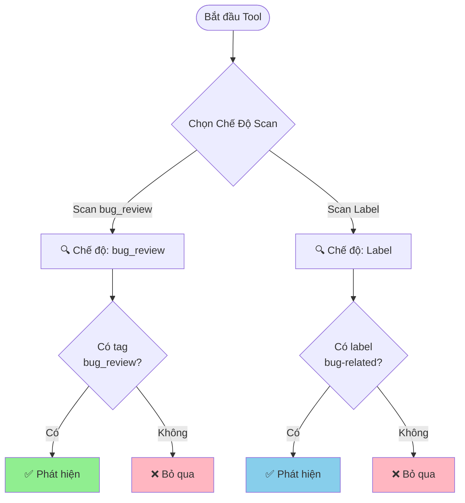

# Hướng Dẫn Phát Hiện Bug

## Giới Thiệu

Hệ thống **Bug Crawler** tự động phân tích các Pull Request (PR) trên GitHub để phát hiện những thay đổi liên quan đến việc sửa lỗi (bug). Hệ thống hoạt động dựa trên **chế độ scan** mà bạn chọn khi chạy tool.

## Các Chế Độ Scan (Scan Modes)

Khi chạy tool, bạn sẽ được yêu cầu chọn một trong hai chế độ scan sau:

### 1. Chế Độ Scan theo `bug_review` Tag

Chế độ này tìm kiếm các PR có chứa tag `bug_review` trong phần mô tả. Đây là cách **chính xác nhất** để đếm số lượng bug cụ thể.

**Cách sử dụng:**

Trong phần mô tả (description) của PR, thêm dòng:

```
bug_review: <số_lượng_bug>
```

**Ví dụ:**

```markdown
## Mô tả
PR này sửa lỗi hiển thị sai định dạng ngày tháng trong báo cáo.

bug_review: 3

## Chi tiết
- Sửa lỗi format ngày tháng
- Sửa lỗi timezone
- Sửa lỗi hiển thị giờ
```

> [!IMPORTANT]
> - Tag `bug_review` **không phân biệt chữ hoa/thường** (có thể viết `BUG_REVIEW`, `Bug_Review`, v.v.)
> - Số lượng bug phải là **số nguyên dương** (1, 2, 3,...)
> - Hệ thống sẽ ghi nhận **số lượng bug** được sửa trong PR này

**Kết quả khi phát hiện:**
- ✅ `IsBugRelated`: `true`
- 📊 `DetectionType`: `"bug_review"`
- 🔢 `BugCount`: Số lượng bug bạn đã ghi
- 🏷️ `MatchedKeyword`: `"bug_review"`

---

### 2. Chế Độ Scan theo Label

Chế độ này tìm kiếm các PR được gắn các **label** liên quan đến bug. Chế độ này phù hợp để tìm kiếm nhanh các PR sửa lỗi mà không cần đếm số lượng bug cụ thể.

**Label nào được nhận diện?**

Hệ thống sẽ tìm các label có chứa các từ khóa sau (không phân biệt chữ hoa/thường):

- `bug` - Lỗi chung
- `fix` - Sửa lỗi
- `hotfix` - Sửa lỗi khẩn cấp
- `critical` - Lỗi nghiêm trọng
- `error` - Lỗi hệ thống
- `issue` - Vấn đề cần sửa

**Ví dụ các label hợp lệ:**
- ✅ `bug`
- ✅ `Bug Fix`
- ✅ `hotfix-payment`
- ✅ `critical-error`
- ✅ `issue/login`
- ✅ `BUGFIX`

**Ví dụ các label KHÔNG được nhận diện:**
- ❌ `feature`
- ❌ `enhancement`
- ❌ `documentation`
- ❌ `refactor`

**Kết quả khi phát hiện:**
- ✅ `IsBugRelated`: `true`
- 📊 `DetectionType`: `"label"`
- 🔢 `BugCount`: `0` (vì không có thông tin cụ thể)
- 🏷️ `MatchedKeyword`: Tên label được tìm thấy (ví dụ: `"bug"`, `"hotfix"`)

---

##  Hướng Dẫn Sử Dụng Cho Các Trường Hợp Thực Tế

### Trường Hợp 1: Sửa Nhiều Bug Trong Một PR

**Tình huống:** Bạn vừa sửa 5 bug khác nhau trong cùng một PR.

**Khuyến nghị:** Sử dụng chế độ scan **`bug_review`**. Thêm tag vào mô tả PR:

```markdown
## Mô tả
PR này sửa các lỗi trong module thanh toán

bug_review: 5
```

### Trường Hợp 2: Hotfix Khẩn Cấp

**Tình huống:** Có lỗi nghiêm trọng trên production cần sửa ngay.

**Khuyến nghị:**
- Nếu bạn muốn đếm số lượng bug chính xác: Thêm `bug_review: 1` và dùng chế độ scan **`bug_review`**.
- Nếu bạn chỉ cần tìm PR: Gắn label `hotfix` và dùng chế độ scan **Label**.

> [!TIP]
> Bạn có thể vừa thêm tag `bug_review` vừa gắn label `hotfix`. Tuy nhiên, kết quả phân tích sẽ phụ thuộc vào chế độ scan bạn chọn khi chạy tool.

### Trường Hợp 3: Refactor Code (Không Phải Bug)

**Tình huống:** Bạn đang tái cấu trúc code để dễ đọc hơn, không sửa bug.

**Khuyến nghị:** KHÔNG sử dụng tag `bug_review` và label bug. PR này sẽ không xuất hiện trong kết quả của cả 2 chế độ scan.

---

## 🔍 Hiểu Kết Quả Phân Tích

Sau khi hệ thống phân tích, mỗi PR sẽ có các thông tin sau:

| Trường | Ý Nghĩa | Giá Trị Có Thể |
|--------|---------|----------------|
| **IsBugRelated** | PR có liên quan đến bug không? | `true` hoặc `false` |
| **DetectionType** | Phát hiện bằng cách nào? | `"bug_review"`, `"label"`, hoặc `""` (rỗng) |
| **BugCount** | Số lượng bug được sửa | Số nguyên ≥ 0 |
| **MatchedKeyword** | Từ khóa/label nào được tìm thấy? | Tên tag hoặc label |

---

## ✅ Best Practices (Thực Hành Tốt Nhất)

### 1. **Thống Nhất Quy Trình Trong Team**
Quyết định xem team sẽ dùng cách nào làm chuẩn: đếm bug chính xác (dùng `bug_review`) hay chỉ cần biết PR nào sửa bug (dùng Label).

### 2. **Luôn Sử Dụng Tag `bug_review` Nếu Cần Số Liệu Chính Xác**
Nếu team bạn cần báo cáo số lượng bug đã sửa hàng tuần/tháng, hãy bắt buộc dùng `bug_review`.

### 3. **Sử Dụng Label Để Phân Loại**
Dù dùng `bug_review`, vẫn nên gắn label (ví dụ `critical`, `ui-bug`) để dễ dàng lọc và tìm kiếm trên giao diện GitHub.

---

## ❓ Câu Hỏi Thường Gặp (FAQ)

### Q1: Tôi chọn chế độ scan "Label", nhưng PR có tag `bug_review` thì sao?
**A:** Nếu PR đó KHÔNG có label bug, nó sẽ KHÔNG được phát hiện trong chế độ scan Label, dù có tag `bug_review`.

### Q2: Tôi chọn chế độ scan "bug_review", nhưng PR có label `bug` thì sao?
**A:** Nếu PR đó KHÔNG có tag `bug_review`, nó sẽ KHÔNG được phát hiện trong chế độ scan `bug_review`, dù có label `bug`.

### Q3: Tôi có thể viết `BUG_REVIEW` thay vì `bug_review` không?
**A:** Có, hệ thống không phân biệt chữ hoa/thường.

### Q4: Label `bugfix` (viết liền) có được nhận diện không?
**A:** Có, trong chế độ scan Label, hệ thống tìm kiếm từ khóa `bug` trong label, nên `bugfix` sẽ match.

---

## 📊 Tóm Tắt Quy Trình



---

## 📞 Hỗ Trợ

Nếu bạn có thắc mắc hoặc gặp vấn đề với hệ thống phát hiện bug, vui lòng:

1. Kiểm tra lại format của tag `bug_review` và label
2. Xem lại các ví dụ trong tài liệu này
3. Liên hệ team để được hỗ trợ

---

**Phiên bản:** 1.1  
**Cập nhật lần cuối:** 2025-11-25
