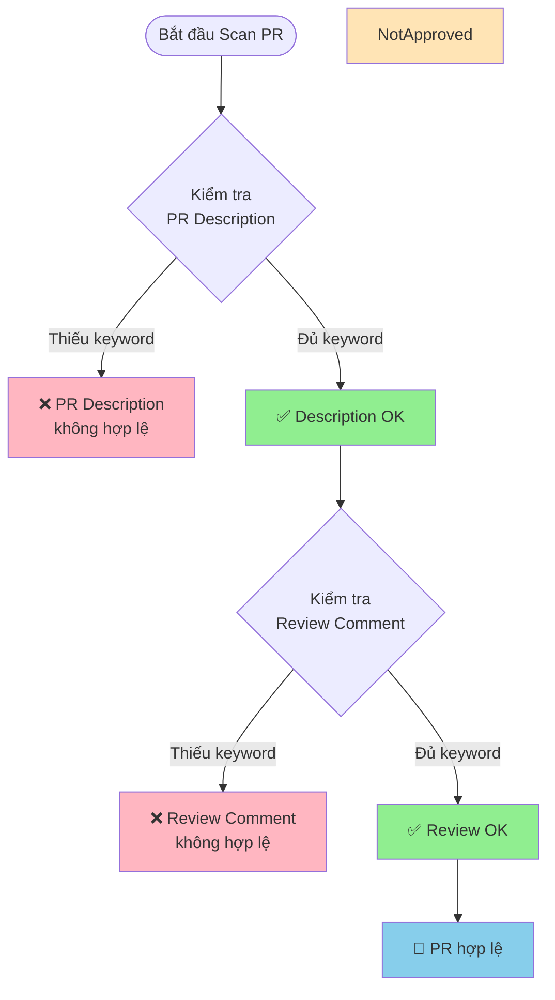

# Hướng Dẫn Scan Pull Request - Code Review Compliance

## Giới Thiệu

Tài liệu này mô tả tính năng **Scan PR theo Code Review** của tool **Bug Crawler**. Tính năng này tự động kiểm tra các Pull Request (PR) trên GitHub để đánh giá mức độ tuân thủ quy trình Code Review, sau đó ghi kết quả vào file **CSV report**.

### Mục Đích

Tool sẽ quét và phân tích:
1. **PR Description**: Kiểm tra xem mô tả PR có đầy đủ các thông tin bắt buộc không
2. **Approval Status**: Kiểm tra xem PR đã được approve chưa
3. **Review Comments**: Kiểm tra xem review comment có đầy đủ các đánh giá cần thiết không

Kết quả được ghi vào file CSV để team có thể:
- 📊 Theo dõi chất lượng Code Review
- 📈 Đánh giá mức độ tuân thủ quy trình
- 🔍 Phát hiện các PR không đạt chuẩn

---

## 📝 Tiêu Chí Kiểm Tra PR Description

Tool sẽ quét phần mô tả (description) của mỗi PR và kiểm tra xem có chứa **ít nhất 3** trong các keyword sau hay không:

### Danh Sách Keyword Được Kiểm Tra

Phần mô tả PR phải bao gồm **TẤT CẢ** các keyword sau:

| Keyword | Ý Nghĩa | Tool Kiểm Tra |
|---------|---------|---------------|
| **Description** | Mô tả tổng quan về PR | ✅ Có |
| **Changes Made** | Danh sách các thay đổi đã thực hiện | ✅ Có |
| **Self-Review** | Checklist tự kiểm tra của người tạo PR | ✅ Có |
| **Functionality** | Mô tả về chức năng được thêm/sửa | ✅ Có |
| **Security** | Đánh giá về bảo mật | ✅ Có |
| **Error Handling** | Cách xử lý lỗi | ✅ Có |
| **Code Style** | Tuân thủ coding convention | ✅ Có |

### Template Tham Khảo

> [!NOTE]
> Template dưới đây giúp bạn hiểu cách tool tìm kiếm các keyword trong PR description. Đây là ví dụ về một PR description đạt chuẩn.

```markdown
## Description
[Mô tả ngắn gọn về mục đích của PR này]

## Changes Made
- [Thay đổi 1]
- [Thay đổi 2]
- [Thay đổi 3]

## Self-Review
- [ ] Code đã được test kỹ lưỡng
- [ ] Đã kiểm tra performance
- [ ] Đã update documentation (nếu cần)

## Functionality
[Mô tả chi tiết về chức năng mới hoặc thay đổi]

## Security
[Đánh giá các vấn đề bảo mật, nếu có]
- Không có lỗ hổng bảo mật
- Đã validate input
- Đã sanitize output

## Error Handling
[Mô tả cách xử lý lỗi]
- Try-catch blocks đã được implement
- Error messages rõ ràng
- Logging đầy đủ

## Code Style
[Xác nhận tuân thủ coding standards]
- Đã chạy linter
- Đã format code theo convention
- Naming conventions được tuân thủ
```

### Ví Dụ Thực Tế

```markdown
## Description
Thêm tính năng xác thực hai yếu tố (2FA) cho module đăng nhập

## Changes Made
- Thêm middleware xác thực 2FA
- Tạo API endpoint `/auth/verify-2fa`
- Cập nhật UI trang đăng nhập
- Thêm unit tests cho 2FA flow

## Self-Review
- [x] Code đã được test với nhiều test cases
- [x] Performance không bị ảnh hưởng
- [x] Đã update API documentation

## Functionality
Người dùng có thể bật/tắt 2FA trong settings. Khi đăng nhập, nếu 2FA được bật, 
hệ thống sẽ yêu cầu nhập mã OTP từ authenticator app.

## Security
- Sử dụng TOTP (Time-based One-Time Password) theo RFC 6238
- Secret key được mã hóa trong database
- Rate limiting cho API verify-2fa (5 lần/phút)
- Session timeout sau 5 phút nếu không verify

## Error Handling
- Invalid OTP: Trả về lỗi 401 với message rõ ràng
- Expired OTP: Yêu cầu generate mã mới
- Too many attempts: Tạm khóa tài khoản 15 phút
- Tất cả errors đều được log với correlation ID

## Code Style
- Đã chạy `golangci-lint` - no issues
- Code formatted với `gofmt`
- Tuân thủ naming convention của project
- Comments đầy đủ cho public functions
```

> [!IMPORTANT]
> Tool sẽ đánh dấu PR là **KHÔNG ĐẠT CHUẨN** (`pr_description_valid = false`) nếu không có đủ ít nhất 3 keywords trong danh sách trên.

---

### Tiêu Chí Kiểm Tra Review Comment

Tool sẽ quét comment của reviewer để kiểm tra xem có đề cập đến **ít nhất 3** trong các khía cạnh sau hay không:

| Keyword | Ý Nghĩa | Tool Kiểm Tra |
|---------|---------|---------------|
| **Functionality** | Đánh giá về chức năng | ✅ Có |
| **Security** | Đánh giá về bảo mật | ✅ Có |
| **Error Handling** | Đánh giá về xử lý lỗi | ✅ Có |
| **Code Style** | Đánh giá về coding style | ✅ Có |

### Template Review Comment Tham Khảo

> [!NOTE]
> Template dưới đây giúp bạn hiểu cách tool tìm kiếm các keyword trong review comment. Đây là ví dụ về một review comment đạt chuẩn.

```markdown
## Review Summary

### Functionality
✅ Chức năng hoạt động đúng như mong đợi
- Đã test các use cases chính
- Edge cases đã được xử lý
- Logic rõ ràng và dễ hiểu

### Security
✅ Không phát hiện vấn đề bảo mật
- Input validation đầy đủ
- Không có SQL injection risk
- Authentication/Authorization đúng

### Error Handling
✅ Error handling tốt
- Try-catch blocks hợp lý
- Error messages rõ ràng
- Logging đầy đủ thông tin debug

### Code Style
✅ Code style tuân thủ convention
- Naming rõ ràng
- Code được format đúng
- Comments đầy đủ

**Approved** ✅
```

### Ví Dụ Review Comment Tool Phát Hiện

#### ✅ Review Comment ĐẠT CHUẨN (Tool Detect: `review_comment_valid = true`)

```markdown
## Code Review - 2FA Implementation

### Functionality
Excellent work! Tính năng 2FA hoạt động mượt mà:
- ✅ QR code generation works perfectly
- ✅ OTP verification logic is solid
- ✅ Backup codes feature is a nice touch
- ⚠️ Suggestion: Consider adding rate limiting per user (not just global)

### Security
Very secure implementation:
- ✅ TOTP follows RFC 6238 correctly
- ✅ Secrets are encrypted with AES-256
- ✅ Rate limiting prevents brute force
- ✅ Session management is secure
- 💡 Minor: Consider adding audit log for 2FA events

### Error Handling
Well handled:
- ✅ All error cases are covered
- ✅ User-friendly error messages
- ✅ Proper logging with context
- ✅ Graceful degradation if authenticator fails

### Code Style
Clean and maintainable:
- ✅ Follows Go conventions perfectly
- ✅ Good separation of concerns
- ✅ Comprehensive unit tests (95% coverage)
- ✅ Documentation is clear

Great job overall! Approved with minor suggestions above.
```

#### ❌ Review Comment KHÔNG ĐẠT CHUẨN (Tool Detect: `review_comment_valid = false`)

```markdown
LGTM! Approved.
```

**Lý do không hợp lệ:** Thiếu tất cả các keyword bắt buộc (Functionality, Security, Error Handling, Code Style)

---

```markdown
Looks good! The functionality works well and code is clean.
```

**Lý do không hợp lệ:** Thiếu keyword "Security" và "Error Handling"

---

## 🔍 Quy Trình Scan Tự Động

Khi bạn chạy tool với chế độ scan PR theo Code Review, tool sẽ thực hiện các bước kiểm tra sau và ghi kết quả vào file CSV:



### Bước 1: Tool Quét PR Description

Tool sẽ quét phần mô tả PR và tìm kiếm các keyword:
- Description
- Changes Made
- Self-Review
- Functionality
- Security
- Error Handling
- Code Style

**Kết quả ghi vào CSV:**
- ✅ `pr_description_valid = true`: Nếu tìm thấy ít nhất 3 keywords
- ❌ `pr_description_valid = false`: Nếu thiếu keywords

### Bước 2: Tool Quét Review Comment

Tool sẽ quét comment của reviewer và tìm kiếm:
- Functionality
- Security
- Error Handling
- Code Style

**Kết quả ghi vào CSV:**
- ✅ `review_comment_valid = true`: Nếu tìm thấy ít nhất 3 keywords
- ❌ `review_comment_valid = false`: Nếu thiếu keywords

---

## 📊 Kết Quả Trong File CSV Report

Sau khi scan, tool sẽ tạo file CSV với các cột thông tin sau cho mỗi PR:

| Cột CSV | Ý Nghĩa | Giá Trị |
|---------|---------|----------|
| **pr_number** | Số PR | Số nguyên |
| **pr_title** | Tiêu đề PR | Text |
| **author** | Tác giả PR | Text |
| **pr_status** | Trạng thái PR | Text (open/closed/merged) |
| **pr_description_valid** | PR description có đủ keywords không? | `true`/`false` |
| **review_comment_valid** | Review comment có đủ keywords không? | `true`/`false` |
| **pr_compliant** | PR tuân thủ đầy đủ quy tắc không? | `true`/`false` |
| **url** | Link đến PR | URL |

### Điều Kiện Để `pr_compliant = true`

Một PR được coi là **tuân thủ đầy đủ** (`pr_compliant = true`) khi:
1. ✅ `pr_description_valid = true` (PR Description có ít nhất 3 keywords)
2. ✅ `review_comment_valid = true` (Review comment có ít nhất 3 keywords)

### Ví Dụ Dữ Liệu CSV

```csv
pr_number,pr_title,author,pr_status,pr_description_valid,review_comment_valid,pr_compliant,url
123,Add 2FA feature,john-doe,merged,true,true,true,https://github.com/org/repo/pull/123
124,Fix login bug,jane-smith,closed,true,false,false,https://github.com/org/repo/pull/124
125,Update README,bob-wilson,open,false,true,false,https://github.com/org/repo/pull/125
126,Refactor auth module,alice-jones,open,true,true,true,https://github.com/org/repo/pull/126
```

---

## ✅ Best Practices - Chuẩn Bị PR Để Tool Scan

### Cho Người Tạo PR

Để PR của bạn đạt chuẩn khi tool scan:

1. **Sử dụng Template**: Copy template tham khảo và điền đầy đủ thông tin
2. **Đảm Bảo Đủ Keywords**: Kiểm tra kỹ xem description có đủ 7 keywords bắt buộc
3. **Mô Tả Chi Tiết**: Viết rõ ràng về Functionality, Security, Error Handling, Code Style
4. **Tự Kiểm Tra**: Đọc lại PR trước khi gửi review

### Cho Reviewer

Để review comment của bạn đạt chuẩn khi tool scan:

1. **Review Toàn Diện**: Đánh giá đủ 4 khía cạnh (Functionality, Security, Error Handling, Code Style)
2. **Sử dụng Template**: Dùng template tham khảo để đảm bảo không bỏ sót keyword
3. **Ghi Rõ Đánh Giá**: Viết cụ thể về từng khía cạnh, không chỉ viết "LGTM"
4. **Constructive Feedback**: Đưa ra góp ý xây dựng kèm theo đánh giá

---

## ❓ Câu Hỏi Thường Gặp (FAQ)

### Q1: Tool có phân biệt chữ hoa/thường khi tìm keyword không?

**A:** Không, tool tìm kiếm không phân biệt chữ hoa/thường. Bạn có thể viết `functionality`, `Functionality`, hoặc `FUNCTIONALITY`.

### Q2: Keyword phải đứng một mình hay có thể nằm trong câu?

**A:** Keyword có thể nằm trong câu. Ví dụ: "The **functionality** works well" vẫn được tool tính là có keyword "Functionality".

### Q3: Nếu PR description hợp lệ nhưng review comment không đủ keyword thì kết quả CSV như thế nào?

**A:** 
- `pr_description_valid = true`
- `review_comment_valid = false`
- `pr_compliant = false`

PR sẽ được đánh dấu là **KHÔNG tuân thủ đầy đủ**.

### Q4: Nếu PR có nhiều reviewers, tool kiểm tra comment của ai?

**A:** Tool sẽ kiểm tra comment của **TẤT CẢ** reviewers. Các comment sẽ được gộp lại và kiểm tra tổng thể xem có đủ ít nhất 3 keywords không.

### Q5: File CSV được lưu ở đâu?

**A:** File CSV sẽ được lưu trong thư mục output mà bạn chỉ định khi chạy tool. Tên file thường có format: `pr_review_report_YYYY-MM-DD.csv`.

### Q6: Làm sao để biết PR nào không đạt chuẩn?

**A:** Mở file CSV và lọc các dòng có `pr_compliant = false`. Sau đó kiểm tra các cột `pr_description_valid` và `review_comment_valid` để biết lý do cụ thể.

---

## 📞 Hỗ Trợ

Nếu bạn có thắc mắc về kết quả scan hoặc cần hỗ trợ:

1. Xem lại các template và ví dụ trong tài liệu này
2. Kiểm tra file CSV để xác định PR nào không đạt chuẩn
3. So sánh PR của bạn với các ví dụ đạt chuẩn
4. Kiểm tra lại checklist các keywords bắt buộc
5. Liên hệ team lead để được hướng dẫn

---

## 📋 Checklist Nhanh - Chuẩn Bị Cho Tool Scan

### Trước Khi Tạo PR (Để Tool Scan Đạt Chuẩn)
- [ ] Description có đủ 7 keywords: Description, Changes Made, Self-Review, Functionality, Security, Error Handling, Code Style
- [ ] Đã viết rõ ràng về từng khía cạnh
- [ ] Đã tự review code kỹ lưỡng
- [ ] Đã test các thay đổi

### Trước Khi Approve PR (Để Review Comment Đạt Chuẩn)
- [ ] Đã review toàn bộ code changes
- [ ] Đã test functionality
- [ ] Đã kiểm tra security implications
- [ ] Đã đánh giá error handling
- [ ] Đã kiểm tra code style
- [ ] Comment có đủ 4 keywords: Functionality, Security, Error Handling, Code Style
- [ ] Đã viết cụ thể về từng khía cạnh (không chỉ "LGTM")

### Sau Khi Tool Scan
- [ ] Mở file CSV report
- [ ] Kiểm tra cột `pr_compliant` để xem PR nào chưa đạt chuẩn
- [ ] Xem lý do cụ thể qua các cột `pr_description_valid`, `review_comment_valid`
- [ ] Cập nhật PR/review comment nếu cần thiết

---

**Phiên bản:** 1.0  
**Cập nhật lần cuối:** 2025-11-27
